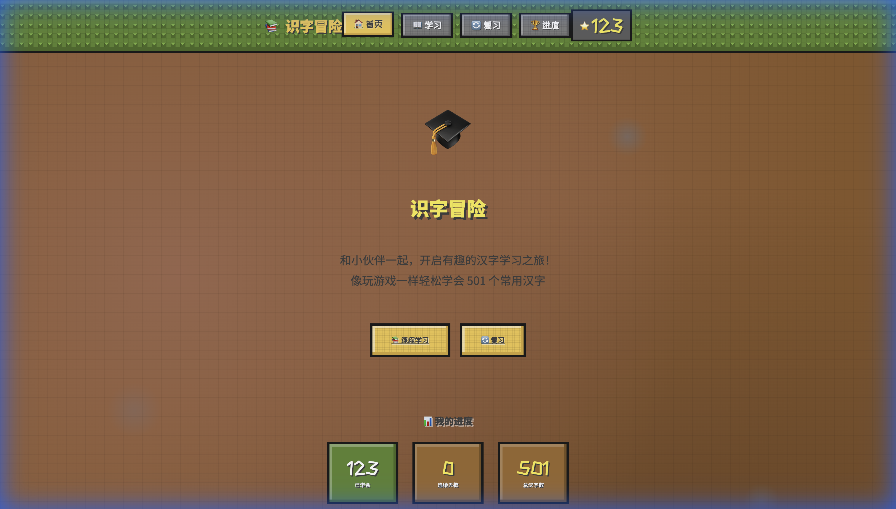
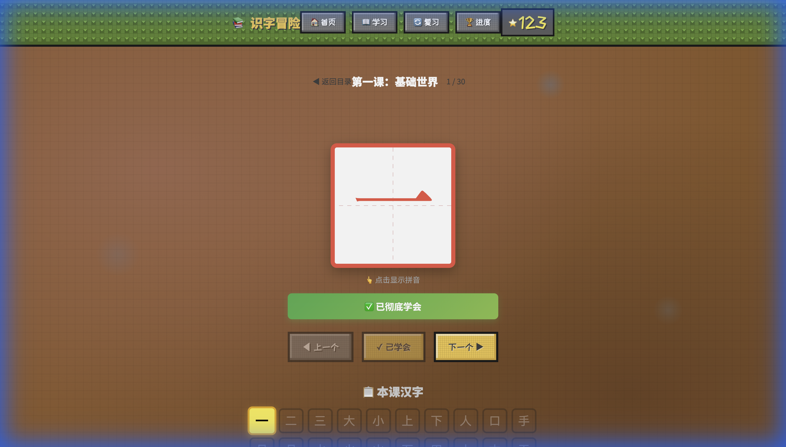

# 识字冒险 - 发布日志

按日期记录每天的版本更新内容。

---
## 2026-01-05

### 🗣️ 语音功能升级
- **ChatTTS 集成**
  - 新增对 ChatTTS 本地语音服务的支持，提供更自然、高质量的语音朗读体验
  - 自动检测服务可用性：如果本地 ChatTTS 服务开启，自动切换为高质量语音；否则平滑回退到浏览器默认语音
  - 优化了语音加载和播放逻辑，确保朗读稳定性

### 🐛 问题修复与优化
- **UI 修正**
  - 修复了课程详情页第三项错误显示为"例句"的问题，现在正确显示为"字的解释"
  - 优化了汉字卡片的显示逻辑，防止笔画动画重叠
- **交互改进**
  - 改进了课程页面的加载状态反馈

## 2026-01-04

### 📚 课程内容重大更新
- **新增第六级至第九级课程（Level 6 - Level 9）**
  - **Level 6 提高级**：包含动作、物质状态、智慧思考、社会组织及生命健康主题。
  - **Level 7 高级**：聚焦高级动作、魔法附魔、机械红石、地形环境及维度结构。
  - **Level 8 挑战级**：专门针对形近字辨析、易错字及复杂动作词汇。
  - **Level 9 精通级**：涵盖建筑大师、探索发现、战斗技巧及珍贵资源等高阶词汇。
  - 所有新增课程（共20课时）均配备专属的 Minecraft 主题造句，帮助孩子在游戏情境中理解汉字。

## 2026-01-02

### 📚 课程内容更新
- **新增第五级课程 (Level 5)**
  - 新增5课时，包含量词、频率副词、程度比较等常用词汇
  - 每个汉字配套Minecraft主题造句
- **汉字故事功能**
  - 支持显示汉字背景故事（替代普通例句）
  - 故事卡片采用专属的棕金色视觉风格

### 🛠 系统优化
- **笔画动画增强**
  - 重构书写动画逻辑，解决网络加载超时卡顿问题
  - 增加资源加载失败的自动处理机制
  - 修复快速切换字符时的动画冲突bug

## 2026-01-01

### 🎨 UI/样式优化

- **田字格汉字卡片**
  - 汉字采用红色（#e54），与田字格边框配色统一
  - 汉字放大至160px，更好地填充田字格空间
  - 田字格使用虚线十字格样式，更接近传统书法练习格
  - 边框改为圆角设计，边框加粗至8px

- **提示文字位置调整**
  - "点击显示拼音" 等提示文字移至田字格外部下方
  - 避免与汉字内容产生视觉冲突

- **汉字详情区域**
  - 背景改为较浅灰色（#777）提升对比度
  - 标签（释义、词语、例句、Minecraft）使用金黄色（#ffd700）
  - 内容文字使用白色，确保清晰可读
  - 词语标签使用绿色背景配深色文字

- **"本课汉字"标题**
  - 移除text-shadow效果，使用纯色文字

- **首页进度条优化**
  - 修复进度条居中对齐问题
  - 增加进度条高度至32px，提升视觉显著性
  - 增大进度百分比字体至0.9rem，确保清晰可读
  - 调整宽度至460px，与上方统计卡片视觉宽度保持一致

### 📸 版本截图
| 首页 | 课程页 |
|:---:|:---:|
|  |  |

---

## 版本说明

- 本项目为识字冒险（中文学习乐园）应用
- 技术栈：React + Vite
- 目标用户：儿童中文识字学习
